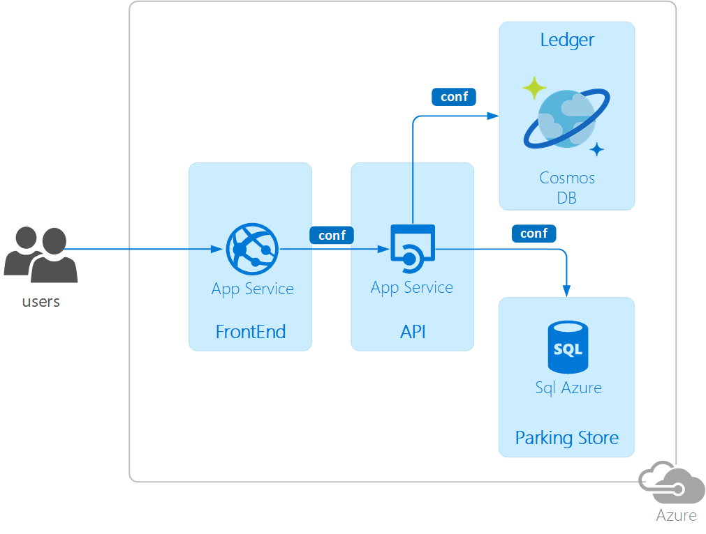

# Parkmeter

Example demo project used in **hands-on labs** to demonstrate several techniques and some reference patterns.
The idea is to mimic a common architecture for a modern web solution.
An **asp.net core** web application composed of different layers:

- **Frontend**
- **API**
- different **Persistence** layers

Each layer is fully separated and isolated. The solution leverages **Dependency Injection** to user the right services at runtime.

The demo scenario is a web application to manage a fully automated car parking:

