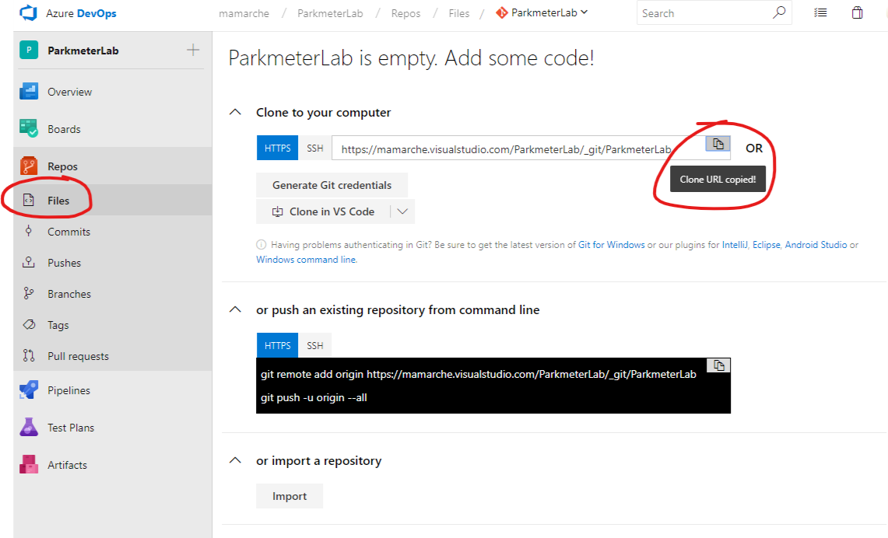
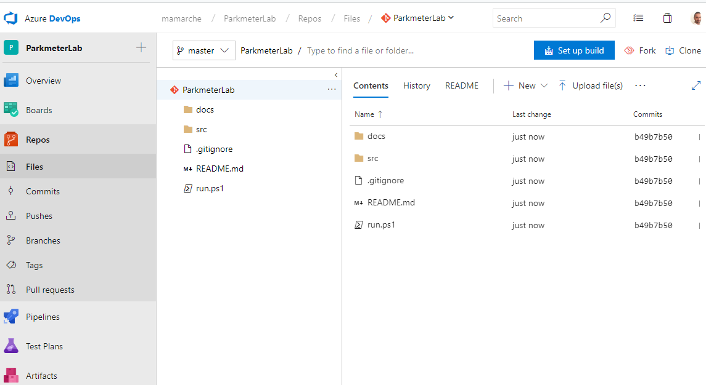
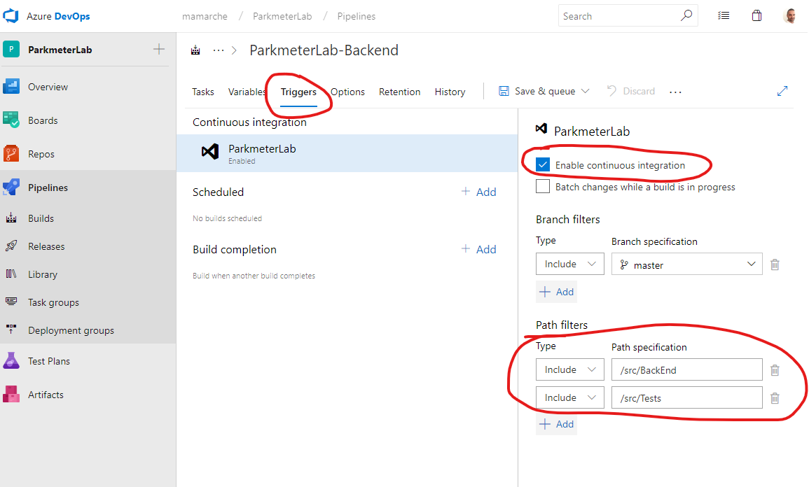
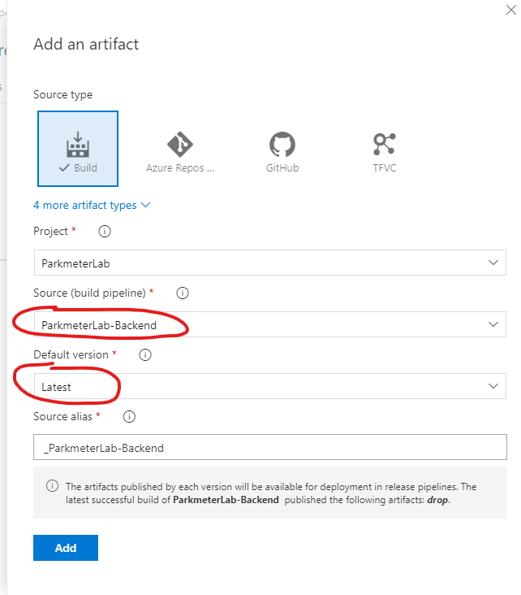
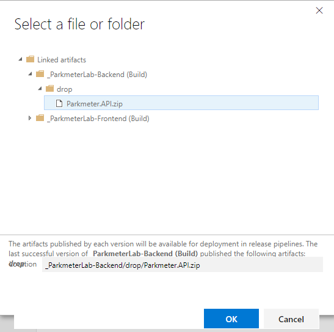
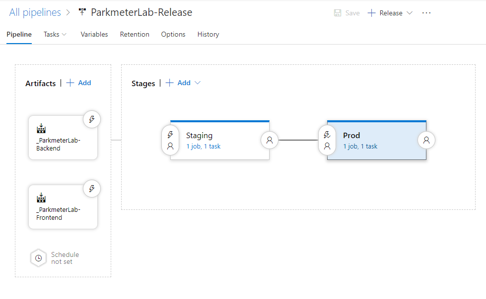

# DevOps Lab

The goal of this lab is to implement CI/CD for this project in order to fully automatize the build and release process. This shows also how to automatically create an Azure infrastructure (IaaC).
The lab is divided in several parts:
- Creation of BUILD definitions for CI
- Deployment of Azure infrastructure (IaaC)
- Creation of RELEASE definitions for CD
- Test of CI/CD

At the end of the lab the project will be under source control and every change will trigger a new deployment in the production environment.

# 0 - Getting started

- download the **stage 0** source code from [here](https://github.com/ocpalps/parkmeter/archive/0.zip)
- unzip the folder and execute **run.ps1**. The project must build successfully and launches two console applications. You might need to give missing persmissions to execute the powershell script:
```powershell
Set-ExecutionPolicy Unrestricted
```
- Browse to [http://localhost:50058/](http://localhost:50058/) and verify that the website works and allows to add a new parking


# 1 - Create a new Azure DevOps project
- Login to Azure DevOps with your Microsoft Account
- Create a new Project of type **Git**
- Go to **Repos** and copy the URL of this new project.
 
- In your machine clone into a new folder (*ParkmeterLab*)
```git
git clone https://[youraccountname].visualstudio.com/[ProjectName]/_git/[ProjectName]
```
- At this stage you need to manually copy the downloaded source code (content of *parkmeter-0* folder) into the new project folder (*ParkmeterLab*)
- Commit and sync the changes to the repository:
```git
git add .
git commit -a -m "initial commit"
git push
```
In your DevOps repo you should now have all the source code:
 

# 2 - Create build definitions
## BACKEND build
- In Azure DevOps go to *Pipelines* and create a new **Build** definition
  - Choose **ASP.NET Core** template
  - Rename to *ParkmeterLab-Backend*
  - Set **Agent Pool** to *Hosted VS2017*
  - Set **Project to restore and build** to ***\Parkmeter.Api.csproj*
  - In **Variables** set *BuildConfiguration* to *Backend*
  - In **Triggers** enable *Continous Integration* and add two path filters:
    - *\src\BackEnd*
    - *\src\Tests*

    

  - Uncheck the *Publish Web Projects* checkbox from **Publish** task 
  - Save the definition and queue a new build

## FRONTEND build
- Create a new **Build** definition
  - Choose **ASP.NET Core** template
  - Rename to *ParkmeterLab-Frontend*
  - Set **Agent Pool** to *Hosted VS2017*
  - Set **Project to restore and build** to ***\Parkmeter.Admin.csproj*
  - In **Variables** set *BuildConfiguration* to *Frontend*
  - In **Triggers** enable *Continous Integration* and add a path filters:
    - *\src\FrontEnd*
  - Uncheck the *Publish Web Projects* checkbox from **Publish** task 
  - Save the definition

# 3 - Deploy Azure Infrastructure
The Azure infrastructure required to host this solution is already defined in the *Deployment* project via [ARM template](/src/Deployment/ParkMeterTemplate/ParkmeterARM.json).
You have many options to deploy the ARM template:
- executing the Deployment project
- from powershell or CLI
- from azure portal

# 3 - Create release definitions
- In Azure DevOps go to *Pipelines* and create a new **Release** definition
  - Start from the **Empty job** template
  - Add two artifacts, one for *ParkmeterLab-Backend* and one for *ParkmeterLab-Frontend* pipelines. Set default version to *Latest*
   
  - Rename *Stage 0* to *Staging* and:
    - Add a new *Azure App Service Deploy* task:
      - DiplayName: *BackEnd*
      - Link your Azure subscription to Azure DevOps (click manage/authorize to insert your credentials). You will be able to see your created resources once the subscrition is  successfully linked.
      - Select the artifact from the API build definition output
      
      - App Type: *API APP*
      - App Service Name: *your azure resource name*
      - Deploy to Slot: *checked*
      - Slot: *your azure slot resource name*
    - Add another task at the same way for *FrontEnd*. Change the setting to *WEB APP* and choose the right azure resources


    - Create a new Stage with name *Prod* using the **Empty job** template:
      - Add a new *Azure App Service Manage* task
        - Set *Action* to *Swap slot*
        - Select the *App Service Name* of the API resource
        - Source slot: *Staging*
        - Check *swap with production*
      - Add another task at the same way for *FrontEnd*.



# 4 - Test CI/CD
At this stage the project is under source control and configured for CI/CD. Any change to this repository code will trigger a new build. If the build succeedes a new release is queued for the staging environment.

As per our configuration the code will flow directly from the staging environment to the production one without any check or approval. It will be better to gate this flow with an administration approval (you can easily set this in Azure DevOps)